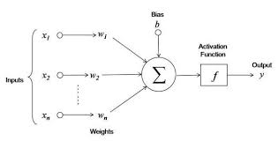

1. What is a neuron ?

    A neuron is a compute unit that makes a linear transformation (multiply wights and add bias) on an input and then aplies non-linearity (activation function) to generate an output.

    

1. What is a neuarl network ?
    
    A neural network consists multiple layers and each layer consists of multiple neurons. In a network, the first layer is called the `input layer` and the last layer is called `output layer`, while every layer between them are called `hidden layer`. 
    
    Width of the network referrs to the number of neurons in a layer and the depth referrs to the number of layers. 
    
    Usually all the neurons in a layer is connected to all the neurons in the previous and next layer. 
    
    The whole network cumulitively tries to represent a funtion between the input and the target variable.

1. Supervised Learning

    Supervised learning is a method of training neural networks when we have both the inputs as well as target variable in our dataset. Here we carefully select what should be the input `X` and target `y` for our model.

    Example:
    1. Predicting real estate price using the features of a home.
    1. Tagging photos in an image.
    1. Speech recognition from an audio.
    1. Machine translation of text from English to Hindi.

1. What is Classification Problem

    A classification problem is when our target can be categorized into specific classes.

    Example:
    1. Predicting that an image is of cat or a dog.
    1. Predicting that the sentiment of a text is happy, sad or neutral.

    When the number of classes is two, the problem is also referred as binary classification.
