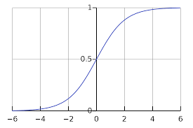
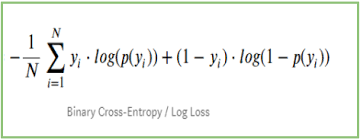
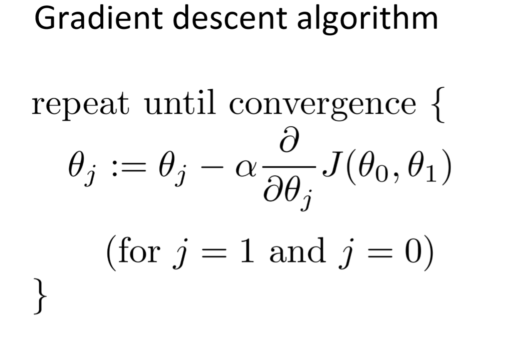

# Logistic Regression

1. When to use ?

    Logistic Regression is used when we want to do binary classification, like classifiying if an image is of a cat or a dog.

1. What do we do ?

    1. Step 1 : Do a liner transformation over the input i.e. multiple the weight and add the bias.
    
    1. Step 2 : Apply a sigmoid activation function on the output of last step so that the final prediction is in the range [0, 1]. 
    
        

1. What is a Cost Function ?

    1. Should give high values for wrong predictions and 0 for correct prediction.
    1. Should be differenciable.
    

1. Log Loss or Cross Entropy

    It is the cost function used for logistic regression. 
    

1. What is Gradient Descent ?

    Gradient Descent is the algoritm used for training deep learning models.

    1. Step 1: Make a prediction using randomly initialized wegiths (most probably using a standard normal distribution).
    1. Calculate the loss using loss function.
    1. Calculate the derivatives of the loss with respect to the weights.
    1. Update the weights in the last layer using these derivates (refer the image below)
    1. Use chain rule to back propogate and update all the weights in the neural network.

    

1. Vectorization 

    Helps speed up the code by getting rid of for loops and using matrices.

