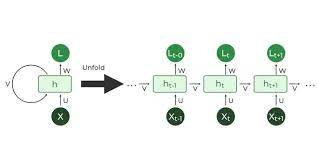
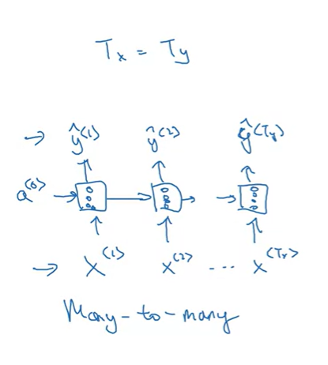
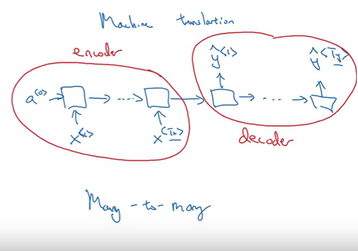
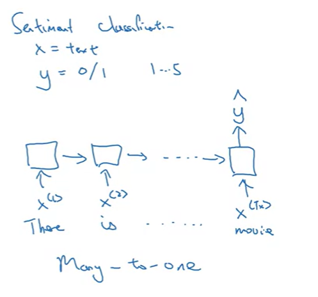
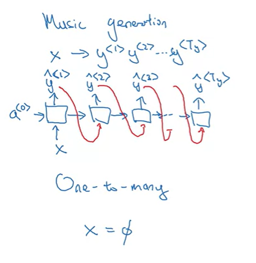

# Sequence Models

## Examples of Tasks requiring Sequence Models 

| Task                      | Input                     | Output                    |
| ------------------------- | ------------------------- | ------------------------- |
| Speech Recognition        | Audio                     | Text                      |
| Music Generation          | Noise                     | Audio                     |
| Sentiment Classification  | Text                      | Class                     |
| DNA Sequence Analysis     | DNA Sequnce               | Proteen Structure         |
| Machine Translation       | Text                      | Text                      |
| Name Entity Recognition   | Text                      | Tags                      |

## Recurrent Neural Network (RNN)

### Why not a standard neural network ?

* Inputs and outputs can be of different lengths in different examples.
* Doesn't share fatures learned across different positions of text.

### What is a RNN ?

It is a neural network architecture that makes use of data from all the previous time stamps inorder to make the predictions for the current time stamps. The weights in a layer remain the same irrespective of the timestamp, the prediction changes depending upon the input from currrent timestamp and the hidden state passed to the layer. Often an array of zeros is used as the hiddent state for the first timestamp.

### Problem with an RNN

#### Only knows about the text from earlier timestamps.

Since RNN uses only the hidden state from past timestamps for the prediction of current timestamp it doesn't know the data that may come in future timestamp which may cause issues.

For example, in the two sentence below

1. He said, "Teddy Roosevelt was a great Presient."
1. He said, "Teddy bears are on sale!"

In the first sentence "Teddy" is a proper noun where as in the second sentece it is a common noun. The model will have a hard time make the correct prediction in this case, as all the words before "Teddy" are same in both the sentences. 

This issue is solved using Bidirectional Recurrent Neural Network.

#### Vanishing Gradient.

RNN is not good at capuring long term dependencies in sentences because of vanishing gradient issue. The predictions made at the last timestamp, will have a hard time affecting the weights of previous timestamps as the backpropogation through time happens.

Example:
* The `cat`, which ate < some text here > , `was` full.
* The `cats`, which ate < some text here > , `were` full.

Here the model might have a hard time finding the relation between the `cat`...`was` and `cats`...`were` as they have a lot of text between them.

GRU is an effective solution for this issue.

#### Exploding Gradient

It is easy to recognize and solve this error as it would cause a numeric overflow or NaN error. We can just use Gradient Clipping for this.

### Different Types of RNN

#### Many to Many

##### Input Length = Output Length

Example : Named Entity Recognition

##### Input Length != Output Length

Example : Neural Machine Translation

#### Many to One

Example : Sentiment Classification

#### One to Many

Example : Music Generation

#### One to One

Here we can just get rid of the hidden state and it would become a standard neural network.
